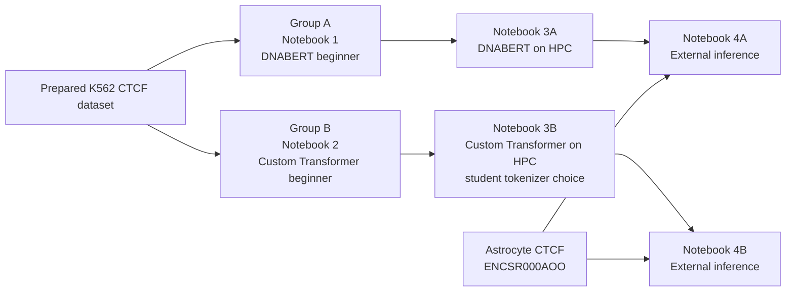

# Intro to HPC Bootcamp: Genome Language Models for Regulatory Genomics

This hands-on bootcamp introduces genome language models, DNA tokenization, PyTorch, and GPU computing on **NERSC Perlmutter** through one biological question:

> Can a model distinguish a CTCF-binding DNA sequence from background DNA?

The latest student pathway is intentionally split into two simplified groups. Each group starts with a beginner notebook, scales the same model family on HPC, and finishes by testing the trained model on CTCF data from a different human cell type.

## Simplified bootcamp structure



### Group A — pretrained DNABERT

1. [`groupA-notebooks/Notebook1_GroupA_DNABERT.ipynb`](groupA-notebooks/Notebook1_GroupA_DNABERT.ipynb) — a beginner-friendly introduction to the K562 dataset, overlapping 6-mer tokenization, local DNABERT, short visible PyTorch, training, and evaluation.
2. [`groupA-notebooks/Notebook3A_GroupA_DNABERT_HPC.ipynb`](groupA-notebooks/Notebook3A_GroupA_DNABERT_HPC.ipynb) — scale DNABERT fine-tuning with Slurm, GPUs, BF16, and PyTorch Distributed Data Parallel (DDP).
3. [`groupA-notebooks/Notebook4_External_Inference_ENCSR000AOO_A.ipynb`](groupA-notebooks/Notebook4_External_Inference_ENCSR000AOO_A.ipynb) — load the trained DNABERT checkpoint and evaluate it on external astrocyte CTCF data.

### Group B — custom Transformer

1. [`groupB-notebooks/Notebook2_GroupB_Transformer.ipynb`](groupB-notebooks/Notebook2_GroupB_Transformer.ipynb) — a beginner-friendly introduction to DNA tokenization and a small custom Transformer built in PyTorch.
2. [`groupB-notebooks/Notebook3B_GroupB_Transformer_HPC.ipynb`](groupB-notebooks/Notebook3B_GroupB_Transformer_HPC.ipynb) — scale the custom Transformer with Slurm and DDP. Students choose the DNA tokenizer they want to investigate.
3. [`groupB-notebooks/Notebook4_External_Inference_ENCSR000AOO_B.ipynb`](groupB-notebooks/Notebook4_External_Inference_ENCSR000AOO_B.ipynb) — reload the custom model with the **same tokenizer used for training** and evaluate it on external astrocyte CTCF data. The notebook can also select the tokenizer with the best validation AUROC when results from multiple tokenizers are available.

Both groups answer the same final scientific question: does a model trained on K562 CTCF binding generalize to CTCF binding in primary astrocytes?

> The root-level notebooks are retained as earlier/full versions. For the latest simplified bootcamp, use the notebooks inside `groupA-notebooks/` and `groupB-notebooks/`.

## Why the beginner notebooks are simpler

The simplified notebooks are designed for students with mixed biology, programming, and HPC experience. They use:

- Mermaid diagrams to show the scientific and computational workflow;
- short, visible PyTorch sections centered on the learning objective;
- hidden helper cells for repetitive training, distributed-computing, and bookkeeping machinery;
- plain-language explanations of each important function and parameter;
- `pandas` only when a table genuinely makes the data or results easier to understand;
- evaluation graphs, including training curves and classification metrics;
- optional visualization playgrounds for students who want to explore further.

Students still run real models and inspect real results, but the first encounter with each idea is kept focused and readable.

## Perlmutter-first quick start

This repository is designed primarily for **NERSC Perlmutter**. Start JupyterLab at [jupyter.nersc.gov](https://jupyter.nersc.gov), sign in with your NERSC account and MFA, and choose a **Shared GPU Node** for the interactive beginner notebooks unless your instructor gives different directions.

Open a JupyterLab terminal and clone the repository into Perlmutter Scratch:

```bash
cd $SCRATCH
git clone https://github.com/joserico00/Intro-to-HPC-Bootcamp-Teaching-Students-to-Leverage-LLMs-for-Regulatory-Genomics-on-HPC.git
cd Intro-to-HPC-Bootcamp-Teaching-Students-to-Leverage-LLMs-for-Regulatory-Genomics-on-HPC
```

Return to the JupyterLab file browser, open the cloned folder under `$SCRATCH`, and then open only your assigned group folder.

Scratch is intended for active, I/O-intensive work and is subject to purging. Keep important code in GitHub and copy important final results to persistent storage. See the [NERSC Jupyter documentation](https://docs.nersc.gov/services/jupyter/reference/), [beginner guide](https://docs.nersc.gov/beginner-guide/), and [Perlmutter Scratch documentation](https://docs.nersc.gov/filesystems/perlmutter-scratch/).

## Perlmutter users can skip Notebook 0

The prepared K562 CTCF machine-learning dataset already exists at:

```text
/global/cfs/cdirs/m4388/projects/project7/ctcf_k562_example
```

It contains the sequence and label files used by the group notebooks:

```text
seqs.txt
labels.txt
```

Therefore, students using the current `m4388` Perlmutter project can skip `Notebook0PreparingDataset.ipynb`. Notebook 0 remains in the repository to explain how genomic peak coordinates and the hg38/GRCh38 reference genome were converted into fixed-length DNA examples and background controls.

If your NERSC project or allocation differs from `m4388`, update the account and project paths in the notebooks before running them.

## Data provenance

The bootcamp uses two CTCF ChIP-seq datasets from ENCODE. They are from different human cell types but use the same hg38/GRCh38 reference assembly.

| Use | Cell type | ENCODE experiment | Peak file | Role |
|---|---|---|---|---|
| Training and internal validation | K562 leukemia cell line | `ENCSR000AKO` | `ENCFF519CXF` | Optimal IDR thresholded CTCF ChIP-seq peaks used to construct positive K562 examples |
| External inference | Primary human astrocytes | `ENCSR000AOO` | `ENCFF450EVR` | CTCF ChIP-seq peaks used to construct an independent cross-cell-type test set |

### K562 training dataset

The prepared training dataset is not a ready-made machine-learning download. It was constructed from:

```text
ENCODE ENCSR000AKO / ENCFF519CXF CTCF peak coordinates
+ hg38 genomic DNA
+ background hg38 regions without selected CTCF peaks
→ approximately 200-bp sequences in seqs.txt
+ binary labels in labels.txt
```

Label `1` represents a CTCF-binding sequence and label `0` represents background DNA.

Notebook 0 currently uses these project files when the dataset needs to be rebuilt:

```text
Peaks:     /global/cfs/cdirs/m4388/projects/project7/data/peaks/ENCFF519CXF.bed.gz
Genome:    /global/cfs/cdirs/m4388/projects/project7/data/genome/hg38.fa.gz
Blacklist: /global/cfs/cdirs/m4388/projects/project7/data/peaks/ENCFF356LFX.bed.gz
```

### Astrocyte external dataset

Notebook 4 uses an external test set derived from ENCODE astrocyte experiment `ENCSR000AOO` and peak file `ENCFF450EVR`. The prepared CSV expected by the current notebooks is:

```text
/global/cfs/cdirs/m4388/projects/project7/test_data/ENCSR000AOO_external_ctcf_test.csv
```

This dataset is used only for external inference, not for fitting the K562-trained model. Keeping the cell type separate provides a more meaningful test of biological generalization.

## Shared Perlmutter resources

The current project environment is:

```text
/global/cfs/cdirs/m4388/envs/dna-llm/bin/python
```

The local DNABERT model used by Group A is:

```text
/global/cfs/cdirs/m4388/projects/project7/models/DNA_bert_6
```

The local model path avoids relying on a Hugging Face download from compute nodes. DNABERT represents a DNA sequence as overlapping 6-mers before passing those tokens through the pretrained Transformer.

You can check the shared Python environment from a terminal with:

```bash
/global/cfs/cdirs/m4388/envs/dna-llm/bin/python -c \
"import torch, transformers, sklearn, pandas, numpy; print(torch.__version__)"
```

The notebooks use packages including `numpy`, `pandas`, `matplotlib`, `scikit-learn`, `torch`, `transformers`, and `tqdm`. Rebuilding the dataset with Notebook 0 also requires `pybedtools` and BEDTools.

## From beginner notebook to HPC notebook

The two tracks intentionally connect introductory model concepts to the way the same work is run on a supercomputer.

| Stage | Group A | Group B |
|---|---|---|
| Beginner | Fine-tune pretrained DNABERT on a manageable subset; understand 6-mers, tensors, predictions, and evaluation | Build a custom Transformer; understand how DNA becomes tokens, embeddings, attention, and predictions |
| HPC | Scale DNABERT with Slurm, BF16, DDP, larger batches, and GPU measurements | Scale the custom Transformer with Slurm, BF16, DDP, and the student's chosen tokenizer |
| External test | Apply the saved DNABERT model to astrocyte CTCF | Apply the saved custom Transformer and its matching tokenizer to astrocyte CTCF |

The HPC notebooks generate the training scripts and Slurm submission files needed for Perlmutter. Important concepts include project accounts, QOS/reservations, GPU counts, ranks, world size, throughput, memory use, and distributed training. Bootcamp reservation names and dates are event-specific and should be verified by the instructor before the session.

For ordinary small tests outside a reservation, review the notebook configuration and use the Perlmutter `shared` QOS with an allowed small GPU request. See [Running jobs on Perlmutter](https://docs.nersc.gov/systems/perlmutter/running-jobs/) and the [NERSC queue policy](https://docs.nersc.gov/jobs/policy/) for current rules.

## Group B tokenizer choice

Group B students can investigate one of the supported DNA representations in Notebook 3B:

| Tokenizer | Basic idea |
|---|---|
| Single nucleotide | Each A, C, G, or T is one token |
| One-hot | Each nucleotide is represented by a four-value vector |
| Overlapping 6-mer | A sliding six-base window moves one base at a time |
| Non-overlapping 6-mer | DNA is divided into separate six-base chunks |
| BPE | Byte Pair Encoding learns common sequence chunks from the training data |

Notebook 4 reconstructs the same representation used during training. This is essential: changing tokenization at inference time would change the model inputs and invalidate the comparison.

## Evaluation and reproducibility

Students examine biological prediction metrics such as accuracy, precision, recall, specificity, F1, AUROC, and AUPRC. The HPC notebooks also record computational measurements such as elapsed time, examples per second, trainable parameters, GPU count, and peak GPU memory.

The notebooks use a fixed seed where possible:

```python
SEED = 42
```

For controlled comparisons, keep the cleaned dataset, train/validation split, and seed fixed, and change one major variable at a time. Distributed GPU training can still contain nondeterministic operations, so the same seed does not guarantee bit-for-bit identical results.

## Running somewhere other than Perlmutter

The beginner notebooks can be adapted to another Linux workstation or compatible GPU environment by changing the data, model, environment, and output paths. Notebook 3A and Notebook 3B are specifically designed around NERSC, Slurm, and NVIDIA GPUs; another HPC system will require changes to the generated scheduler options and launch commands.

Review at least these settings when adapting the material:

- dataset and external-test paths;
- local DNABERT path;
- Python environment;
- NERSC/Slurm account, QOS, reservation, and GPU count;
- project and results directories.

## Scientific inspiration and attribution

This bootcamp was developed in part from ideas discussed in:

> Liyuan Shu, Jiao Tang, Xiaoyu Guan, and Daoqiang Zhang. **“A comprehensive survey of genome language models in bioinformatics.”** *Briefings in Bioinformatics*, Volume 27, Issue 1, 2026, bbaf724.

- [Article and DOI](https://doi.org/10.1093/bib/bbaf724)
- [Open-access article at PubMed Central](https://pmc.ncbi.nlm.nih.gov/articles/PMC12805252/)

The review covers genome-language-model architectures, tokenization, pretraining and fine-tuning, evaluation, downstream genomic applications, and computational requirements. This repository is an educational implementation inspired by those concepts; it is not an official implementation or reproduction of the paper.

## Before the bootcamp

```text
[ ] Repository is cloned into $SCRATCH
[ ] The assigned group folder opens in JupyterLab
[ ] Shared Python environment imports successfully
[ ] K562 prepared dataset is accessible
[ ] External astrocyte test CSV is accessible
[ ] Local DNABERT model is accessible for Group A
[ ] NERSC account and bootcamp reservation settings are current
[ ] Beginner notebook sees a GPU
[ ] HPC notebook preflight checks succeed
```
